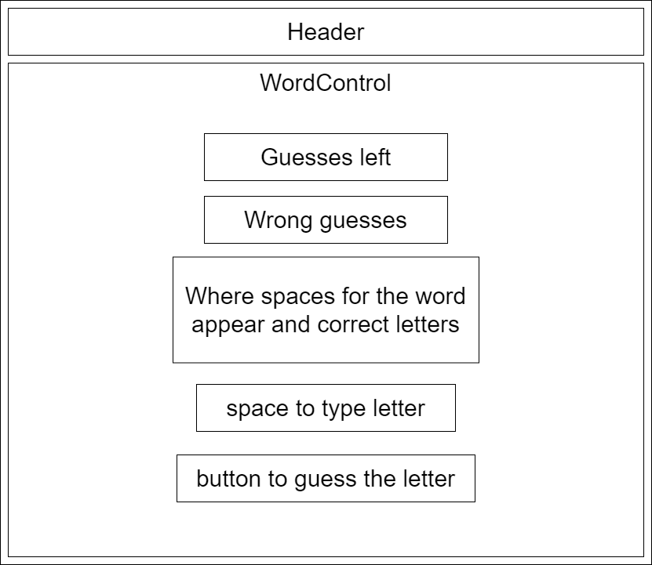

# Word Puzzle

#### By _Seung Lee, Grace Kostanich_

#### _A simple webpage with a word puzzle._

## Technologies Used

* _HTML_
* _JavaScript_
* _React_
* _Redux_
* _CSS_

## Description

A guess what letters go in the word.

## Component Tree

## Setup/Installation Requirements

_Requires console application such as Git Bash, Terminal, or PowerShell_

1. Open Git Bash or PowerShell if on Windows and Terminal if on Mac
2. Run the command

    ``git clone https://github.com/leark/wordpuzzle.git``

3. Run the following command in the console

    ``cd wordpuzzle``

4. Run the following command in the console

    ``npm build``

5. Run the following command in the console

    ``npm start``

## Known Bugs

* _No known issues_

## License

[GNU](/LICENSE)

Copyright (c) 2022 Seung Lee, Grace Kostanich
